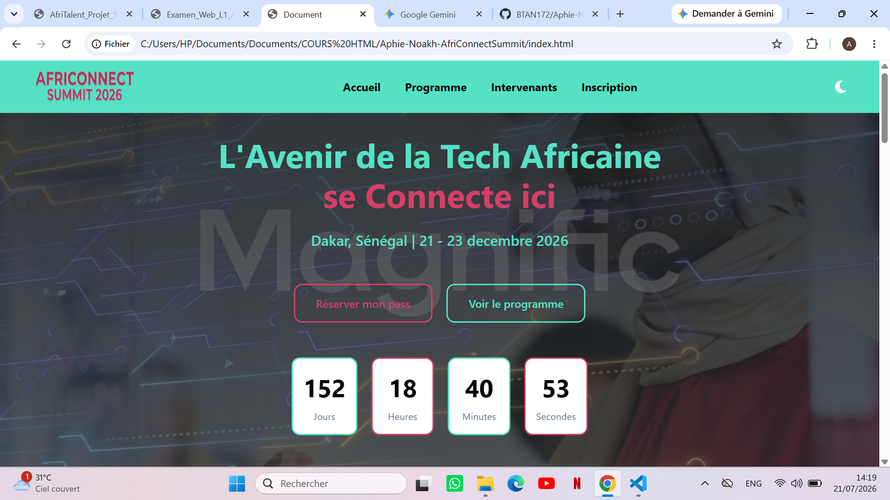
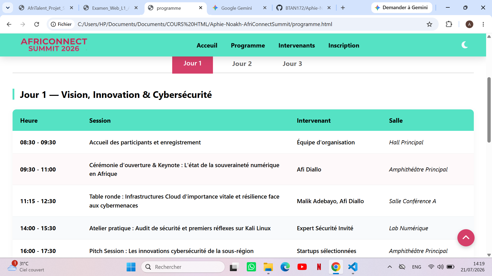

# AfriConnect Summit 2026

Auteur : Aphie-Noakh B'SEME-TATI

Promotion : L1 Web — ISI

# Description
AfriConnect Summit est une plateforme web moderne et responsive dédiée à un sommet technologique panafricain. Le site permet aux participants de découvrir les thématiques phares (IA, Cybersécurité, Fintech), de consulter le planning détaillé des conférences sur plusieurs jours et de s'inscrire en ligne. L'accent a été mis sur l'accessibilité, la fluidité de l'interface et la sécurité front-end.

# Technologies Utilisées
* **HTML5** : Structure sémantique et accessibilité (ARIA, rôles).

* **CSS3** : Layouts avancés (Flexbox, Grid), variables natives et animations personnalisées.

* **JavaScript** (Vanilla) : Manipulation du DOM, gestion d'événements et stockage local sans frameworks externes.

* **Git & GitHub** : Versionnage rigoureux et déploiement via GitHub Pages.

# Fonctionnalités Principales
* **Mode Sombre (Dark Mode)** : Toggle interactif avec persistance du choix via localStorage.

* **Filtrage Dynamique** : Système de tri des cartes d'intervenants par catégorie sans rechargement de page.

* **Animations au Scroll** : Compteurs statistiques animés et apparitions (fade-in) des sections via          IntersectionObserver.

* **Validation de Formulaire** : Contrôle complet côté client (Regex email, longueur de message) avec retours visuels.

* **Navigation Adaptative** : Navbar collante (sticky) qui change d'apparence au défilement.

* **Système d'onglets asynchrone** : Navigation fluide entre les plannings des Jour 1, Jour 2 et Jour 3 sans rechargement de page.

* **Composants dynamiques** : Compte à rebours avant l'événement et injection automatique de l'année dans le footer.

# Aperçu du Projet

# Installation et Utilisation Locale
1.	Cloner le dépôt :
Bash
git clone https://github.com/BTAN172/Aphie-Noakh-AfriConnectSummit.git
2.	Ouvrir le projet :
* **Naviguez dans le dossier du projet**.

* **Ouvrez le fichier index.html dans votre navigateur Web**.

3.	Déploiement :
* **Le site est également consultable en ligne via GitHub Pages**:  https://btan172.github.io/Aphie-Noakh-AfriConnectSummit/ 

# Ressources Consultées
* **MDN Web Docs** : Références techniques HTML/JS.

* **Documentation Bootstrap 5** : Références pour la gestion des utilitaires de grilles et la réactivité des tableaux.

* **W3C Validator** : Validation de la conformité du code.